# MIPS单周期CPU设计文档
## 一、设计草稿
### （一）整体结构

根据 MARS MIPS 数据通路，设计MIPS单周期CPU  
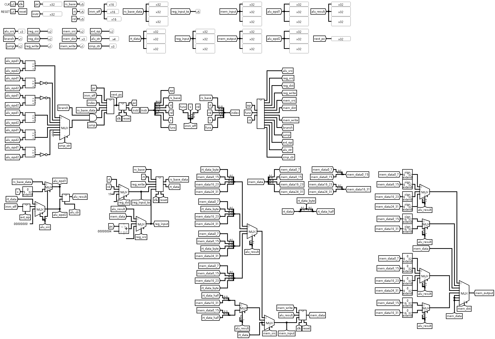
设计 IFU、GRF、ALU、DM、EXT 和 Controller 模块  
未设计 ALU Controller 模块，因为 Logisim 无需考虑实际处理器设计的复杂度和时序问题  
为了布线方便、拓展性好，还设计了NPC模块用于计算下一PC的值（也可合并至IFU），CMP模块用于分支条件判断（也可合并至ALU）  
为了调试方便，将部分中间信号连接至不同显示方式的 Probe 组件显示
### （二）模块设计
#### 1. IFU（取指令单元）
##### （1）整体结构
| 信号名 | 位宽 | 方向 | 描述 |
| :----: | :----: | :----: | :----: |
| CLK | 1 | I | 时钟信号 |
| RESET | 1 | I | 异步复位信号 |
| NEXT_PC | 32 | I | 下一指令地址 |
| PC | 32 | O | 当前指令地址 |
| INSTR | 32 | O | 指令 |

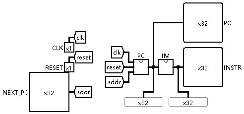  
起始地址：0x00003000  
地址范围：0x00003000 ~ 0x00006FFF  
存储容量：64KB(4096 * 32bit)
##### （2）PC（程序计数器）
| 信号名 | 位宽 | 方向 | 描述 |
| :----: | :----: | :----: | :----: |
| CLK | 1 | I | 时钟信号 |
| RESET | 1 | I | 异步复位信号 |
| NEXT_PC | 32 | I | 下一指令地址 |
| PC | 32 | O | 当前指令地址 |

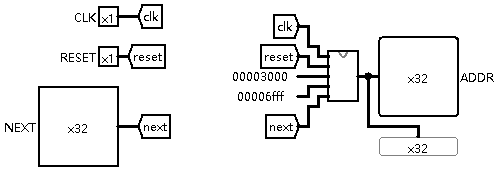  
设计32位带范围的异步复位寄存器  
使用Register部件实现  
初值实现参考了讨论区的一篇[讨论贴](http://cscore.buaa.edu.cn/#/discussion_area/1348/1477/posts)  
当 NEXT_PC > 0x00006FFF 时同步复位至初值

##### （3）IM（指令存储器）
| 信号名 | 位宽 | 方向 | 描述 |
| :----: | :----: | :----: | :----: |
| ADDR | 32 | I | 指令地址 |
| INSTR | 32 | O | 指令 |

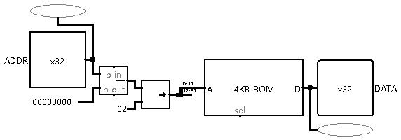  
使用ROM部件实现  
为使 ROM 的 0 位置存储的是 PC 为 0x00003000 的指令，且存储容量为 64KB  
ADDR 减 0x00003000 后，逻辑右移2位，截取[11:0]作为 ROM 的地址输入  
地址宽度为 12 位，数据宽度为 32 位的 ROM 的存储容量恰为 $2^{12}*32bit=64$ KB
#### 2. GRF（通用寄存器组）
| 信号名 | 位宽 | 方向 | 描述 |
| :----: | :----: | :----: | :----: |
| CLK | 1 | I | 时钟信号 |
| RESET | 1 | I | 异步复位信号 |
| RA1 | 5 | I | 读寄存器1号 |
| RA2 | 5 | I | 读寄存器2号 |
| WE | 1 | I | 寄存器写使能 |
| WA | 5 | I | 写寄存器号 |
| WD | 32 | I | 写寄存器数据 |
| RD1 | 32 | O | 读寄存器1数据 |
| RD2 | 32 | O | 读寄存器2数据 |

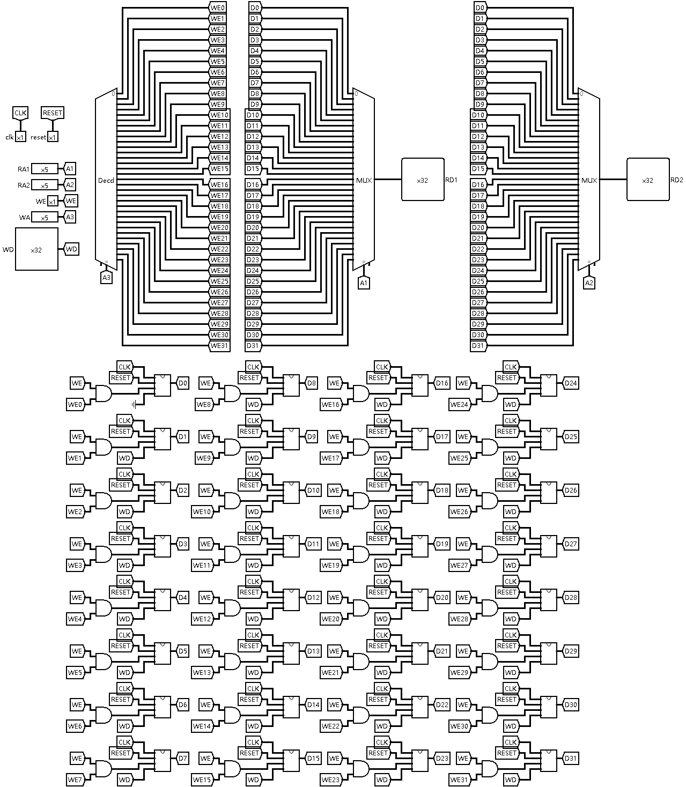  
使用 P1 GRF 模块，稍作修改电路外观  
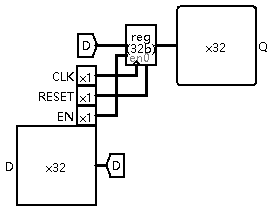  
设计 32 位带使能的异步复位寄存器  
GRF使用32个上述寄存器，使用 32 选 1 MUX 选择寄存器读出，使用 5-32 Decoder 选择寄存器写使能  
其中 0 号寄存器的输入端口接地，使其值始终保持为 0
#### 3. ALU（算术逻辑单元）
##### （1）模块结构
| 信号名 | 位宽 | 方向 | 描述 |
| :----: | :----: | :----: | :----: |
| OPD1 | 32 | I | 操作数1 |
| OPD2 | 32 | I | 操作数2 |
| OP | 4 | I | 操作类型 |
| RESULT | 32 | O | 运算结果 |
| OVER | 1 | O | 溢出标志 |

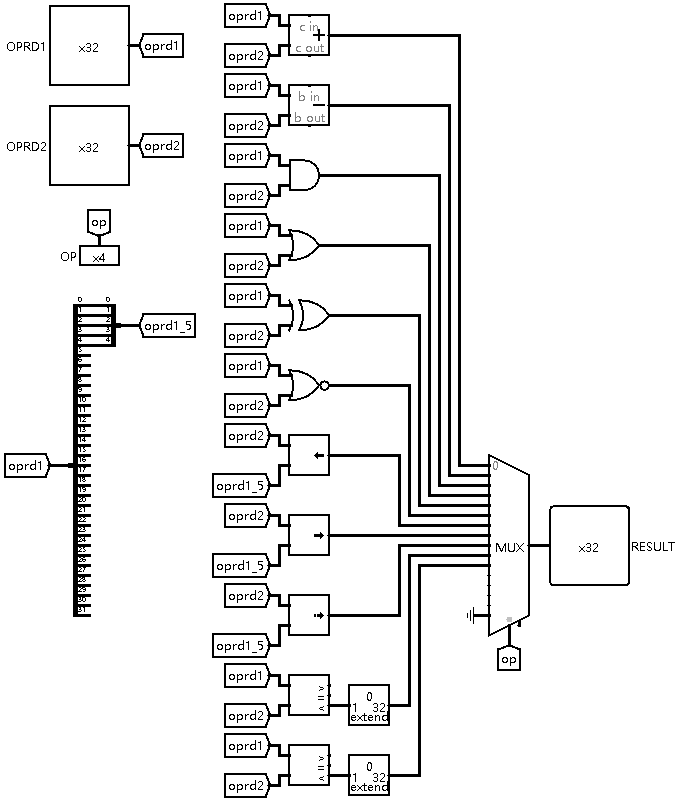  
使用 Arithmetic 类组件实现  
使用 16 选 1 DMX 选择结果输出
##### （2）功能描述
| OP | 功能 |
| :----: | :----: |
| 0000 | 加 |
| 0001 | 减 |
| 0010 | 按位与 |
| 0011 | 按位或 |
| 0100 | 按位异或 |
| 0101 | 按位或非 |
| 0110 | 逻辑左移 |
| 0111 | 逻辑右移 |
| 1000 | 算数右移 |
| 1001 | 有符号小于 |
| 1010 | 无符号小于 |
| 1011 | 等于 |
| 1100 | 有符号大于 |

参考 [MIPS32 Architecture For Programmers](http://cscore.buaa.edu.cn/assets/cscore-assets/MIPS_Vol2_%E6%8C%87%E4%BB%A4%E9%9B%86_.pdf) 和 MARS Help 手册选取必须实现的算术和逻辑操作  
编写程序时，其他算数和逻辑操作由基本指令的组合（伪指令）实现
#### 4. DM（数据存储器）
| 信号名 | 位宽 | 方向 | 描述 |
| :----: | :----: | :----: | :----: |
| CLK | 1 | I | 时钟信号 |
| RESET | 1 | I | 异步复位信号 |
| WE | 1 | I | 内存写使能 |
| ADDR | 32 | I | 读写内存地址 |
| WD | 32 | I | 写内存数据 |
| RD | 32 | O | 读内存数据 |

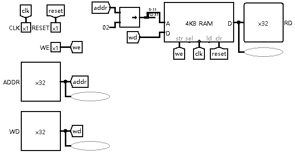  
起始地址：0x00000000  
地址范围：0x00000000 ~ 0x00002FFF  
存储容量（应为）：48KB(3072 * 32bit)

使用 RAM 部件实现，双端口模式  
ld端口不接引脚，防止输出高阻态  
ADDR 逻辑右移 2 位，截取[11:0]作为RAM的地址输入  
地址宽度为 12 位，数据宽度为 32 位的 RAM 的容量为$2^{12}*32bit=64$ KB

*暂未想到如何有效限制存储容量到48KB*  
*如果使用 4 个 RAM 部件通过地址拓展实现DM，会使字节、半字访问指令实现更加容易，同时可以实现非对齐访问指令*
#### 5. EXT（扩展单元）
##### （1）模块结构
| 信号名 | 位宽 | 方向 | 描述 |
| :----: | :----: | :----: | :----: |
| OPD | 32 | I | 操作数 |
| OP | 2 | I | 操作类型 |
| RESULT | 32 | O | 结果 |

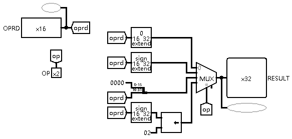  
使用 Bit Extender 和 Splitter 实现  
使用 4 选 1 MUX 选择结果输出
##### （2）功能描述
| OP | 功能 |
| :----: | :----: |
| 00 | 零拓展 |
| 01 | 符号拓展 |
| 10 | 加载到高16位，低位补0 |
| 11 | 符号拓展后左移2位 |

*虽然 EXT 单元设计有“符号拓展后左移2位”的功能，  
但根据 P3 教程和 MARS MIPS 数据通路，分支/跳转指令的实现并不使用EXT，而是单独计算地址拓展和偏移  
实际上，这个功能未曾用到*
#### 6. Controller（控制器）
##### （1）整体结构
###### ① 设计思路
控制器实际上是一个解码器，它将每一条机器指令解析为 CPU 各模块的控制信号

最直接的实现方法就是生成真值表，但是这样在实际操作中不具有可扩展性与易调试性。增加指令时必须重新生成真值表，非常容易产生 Bug，也不利于调试。为了使逻辑易于阅读，功能便于调试，采取指令识别和信号生成分离的方式实现。
###### ② 模块结构
| 信号名 | 位宽 | 方向 | 描述 |
| :----: | :----: | :----: | :----: |
| OP | 6 | I | INSTR[31:26] |
| FUNC | 6 | I | INSTR[5:0] |
| RT | 5 | I | INSTR[20:16] |
| ALUSrc | 3 | O | ALU操作数来源选择 |
| RegSrc | 2 | O | 寄存器写入数据来源选择 |
| RegDest | 2 | O | 寄存器写入数据位置选择 |
| RegWrite | 1 | O | 寄存器写使能 |
| MemSrc | 2 | O | 内存写入数据方式选择 |
| MemDest | 3 | O | 内存读出数据方式选择 |
| MemWrite | 1 | O | 内存写使能 |
| Branch | 1 | O | 分支信号 |
| Jump | 2 | O | 跳转信号 |
| EXTOp | 2 | O | EXT操作类型 |
| ALUOp | 4 | O | ALU操作类型 |
| CMPOp | 3 | O | CMP操作类型 |

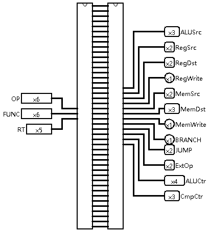  
###### ③ 信号说明
| ALUSrc | 第一个ALU操作数来源 | 第二个ALU操作数来源 |
| :----: | :----: | :----: |
| 000 | rs寄存器 | rt寄存器 |
| 001 | INSTR[10:6] | rt寄存器 |
| 010 | rs寄存器 | 立即数/偏移 |
| 100 | rs寄存器 | 32'd0 | 

| RegSrc | 寄存器写入数据来源 |
| :----: | :----: |
| 00 | ALU |
| 01 | Memory |
| 10 | PC + 4 |

| RegDest | 写入寄存器位置选择 |
| :----: | :----: |
| 00 | rt |
| 01 | rd |
| 10 | 5'd31(ra) |

| MemSrc | 内存写入数据方式选择 |
| :----: | :----: |
| 00 | byte |
| 01 | half |
| 11 | word |

| MemDest | 内存读出数据方式选择 |
| :----: | :----: |
| 000 | signed byte |
| 001 | signed half |
| 010 | word |
| 011 | unsigned byte |
| 100 | unsigned half |

| Jump | 跳转信号 |
| :----: | :----: |
| 00 | 不跳转 |
| 01 | 跳转到立即数 |
| 10 | 跳转到寄存器 |
##### （2）指令识别
| 信号名 | 位宽 | 方向 | 描述 |
| :----: | :----: | :----: | :----: |
| OP | 6 | I | INSTR[31:26] |
| FUNC | 6 | I | INSTR[5:0] |
| RT | 5 | I | INSTR[20:16] |
| *** | *** | O | ***指令信号|
……
| *** | *** | O | ***指令信号|

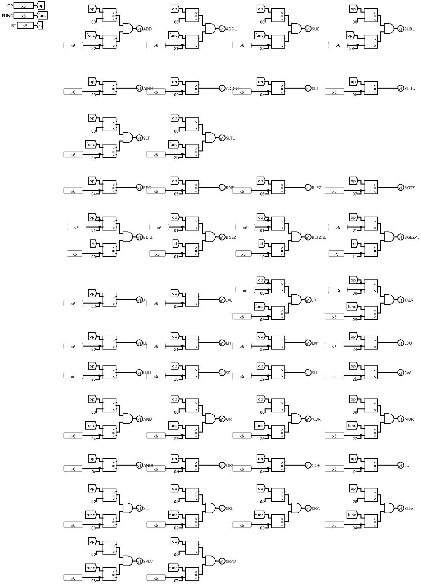  
使用 Comparator 组件实现  
需要识别哪些指令就增加哪种指令信号的输出端口  
由于 Constant 默认显示十六进制，而[MIPS-C指令集](http://cscore.buaa.edu.cn/assets/cscore-assets/MIPS-C%E6%8C%87%E4%BB%A4%E9%9B%86_%E6%A0%A1%E5%AF%B9%E5%AE%8C%E6%88%90%E7%89%88_-%E6%8C%87%E4%BB%A4%E6%8E%92%E5%BA%8F.pdf)所示指令为二进制，故连接 Probe 以便调试  
##### （3）信号生成
| 信号名 | 位宽 | 方向 | 描述 |
| :----: | :----: | :----: | :----: |
| *** | 1 | I | ***指令信号|
……
| *** | 1 | I | ***指令信号|
| ALUSrc | 3 | O | ALU操作数来源选择 |
| RegSrc | 2 | O | 寄存器写入数据来源选择 |
| RegDest | 2 | O | 寄存器写入数据位置选择 |
| RegWrite | 1 | O | 寄存器写使能 |
| MemSrc | 2 | O | 内存写入数据方式选择 |
| MemDest | 3 | O | 内存读出数据方式选择 |
| MemWrite | 1 | O | 内存写使能 |
| Branch | 1 | O | 分支信号 |
| Jump | 2 | O | 跳转信号 |
| EXTOp | 2 | O | EXT操作类型 |
| ALUOp | 4 | O | ALU操作类型 |
| CMPOp | 3 | O | CMP操作类型 |

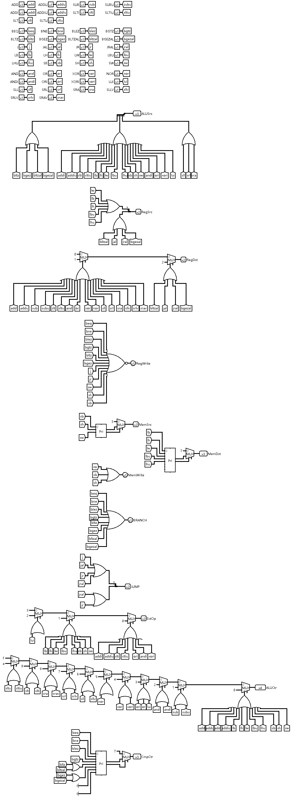  
参考 [MIPS32 Architecture For Programmers](http://cscore.buaa.edu.cn/assets/cscore-assets/MIPS_Vol2_%E6%8C%87%E4%BB%A4%E9%9B%86_.pdf) 和 [MIPS-C指令集](http://cscore.buaa.edu.cn/assets/cscore-assets/MIPS-C%E6%8C%87%E4%BB%A4%E9%9B%86_%E6%A0%A1%E5%AF%B9%E5%AE%8C%E6%88%90%E7%89%88_-%E6%8C%87%E4%BB%A4%E6%8E%92%E5%BA%8F.pdf) 中指令的RTL语言，得出指令与信号的对应关系
## 二、测试方案
### （一）手动测试
编写 MIPS 代码，或使用 Pre 和 P2 的课下提交题目，注意不能含有 syscall 指令，需要用读写内存的方式替代输入输出  
编译导出为 Hexadecimal Text，并在文件开头写入  

    v2.0 raw
导入至 IM 模块中的 ROM 组件，即可开始调试，观察 Probe 显示的各中间信号取值是否与理论一致
### （二）自动测试
使用讨论区[讨论帖](http://cscore.buaa.edu.cn/#/discussion_area/1425/1477/posts)中的评测机
## 三、思考题
### （一）单周期 CPU 所用到的模块中，哪些发挥状态存储功能，哪些发挥状态转移功能?
IFU、GRF 和 DM 发挥发挥状态存储功能  
ALU、EXT 和 Controller 发挥状态转移功能  
此外，上文所述额外设计的 NPC 和 CMP 模块也发挥发挥状态转移功能
### （二）IM 使用 ROM，DM 使用 RAM，GRF 使用 Register，这种做法合理吗？请给出分析。若有改进意见也请一并给出。
基本合理  
IM 中指令不可变，和 ROM 的只读性质相符合  
DM 中内存可变，和 RAM 的可读写可复位性质相符合  
GRF 即通用寄存器堆，对应 Register 实现，需进行一定封装

但实际计算机的 IM 和 DM 一般均由 RAM 实现  
指令和数据位于不同的地址空间，由软件保护指令不被篡改  

同时，现有设计不能直接支持按字节、半字访问和非对齐访问  
如使用 4 个 RAM 做地址拓展会更加直接
### （三）在上述提示的模块之外，你是否在实际实现时设计了其他的模块？如果是，请给出介绍和设计的思路。
我还设计了 NPC 和 CMP 模块  
上文已经有过介绍
### （四）实现 nop 空指令，并不需要将它加入控制信号真值表，为什么？
从部分指令设计的角度看，nop 指令不与任何指令匹配，控制信号均为 0，CPU 不进行任何操作，达到要求
从全部指令设计的角度看，nop 指令即 sll $0, $0, $0，无须特殊判断
### （五）阅读 Pre 的 “MIPS 指令集及汇编语言” 一节中给出的测试样例，评价其强度（可从各个指令的覆盖情况，单一指令各种行为的覆盖情况等方面分析），并指出具体的不足之处。
该测试样例的强度较高。先由最基本的可独立判断正误的指令进行验证，之后再在其基础上对更高层指令的正误进行验证，且各个指令的覆盖情况较为完整，但极端情况有所不足。