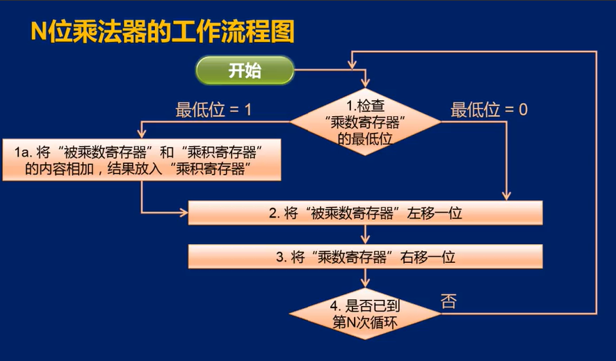
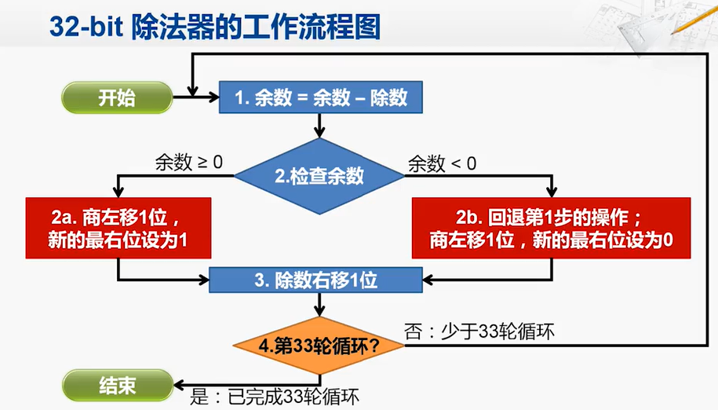

# Verilog MIPS 五级流水线 CPU

## 一、设计草稿

功能模块： PC、GRF、EXT、CMP、NPC、ALU、MDU、BE、DE、Control 和 HazardControl。
流水线寄存器：ID_REG、DE_REG、EM_REG、MW_REG。

变量声明移至文件开头，按使用顺序、流水级顺序排列，便于增删查改和 VCS 编译测试。
不再声明截取指令的中间变量，转用宏定义直接连接，降低冗余代码量。

非法的组合逻辑控制信号将导致未定值，非法的时序逻辑控制信号将导致值不变，便于仿真调试。
转发数据暂时不在此列。

一级信号尽早译码，二级信号参与流水，预留可能的逐级更新数据通路。

由于除零错误的实现要求为 HI、LO 寄存器的值保持不变，而是否除零无法在 D 级判断（乘除指令 Tuse = 1）。
在不增加新的阻塞级的前提下，将 MDU 相关指令一律阻塞。
因此 MDU 的打断功能实际上不会触发，即此实现不会提高连续乘除的执行效率。

存储器外置引入的变量按命名规则包装后使用，统一代码风格。

### （一）F 级

#### （1）PC

| 信号名  | 方向 |    类型     |     描述     |
| :-----: | :--: | :---------: | :----------: |
|   clk   |  I   |    wire     |   时钟信号   |
|  reset  |  I   |    wire     | 同步复位信号 |
|  stall  |  I   |    wire     |   阻塞信号   |
| next_PC |  I   | wire [31:0] | 下一指令地址 |
|   PC    |  O   | wire [31:0] | 当前指令地址 |

起始地址：0x00003000

阻塞信号为高电平时，忽略输入，内部寄存器保持一个时钟周期。

### （二）D 级

FD 流水线寄存器

| 信号名  | 方向 |    类型     |     描述     |
| :-----: | :--: | :---------: | :----------: |
|   clk   |  I   |    wire     |   时钟信号   |
|  reset  |  I   |    wire     | 同步复位信号 |
|  stall  |  I   |    wire     |   阻塞信号   |
|  flush  |  I   |    wire     |   刷新信号   |
|  F_PC   |  I   | wire [31:0] |   F 级 PC    |
| F_instr |  I   | wire [31:0] |   F 级指令   |
|  D_PC   |  O   | wire [31:0] |   D 级 PC    |
| D_instr |  O   | wire [31:0] |   D 级指令   |

信号优先级：reset > stall > flush
保证复位优先，且阻塞时不清空延迟槽

#### 1. GRF

|    信号名    | 方向 |    类型     |         描述          |
| :----------: | :--: | :---------: | :-------------------: |
|     clk      |  I   |    wire     |       时钟信号        |
|    reset     |  I   |    wire     |     同步复位信号      |
| read_number1 |  I   | wire [4:0]  |      读寄存器1号      |
| read_number2 |  I   | wire [4:0]  |      读寄存器2号      |
| write_enable |  I   |    wire     |     寄存器写使能      |
| write_number |  I   | wire [4:0]  |      写寄存器号       |
|  write_data  |  I   | wire [31:0] |     写寄存器数据      |
|      PC      |  I   | wire [31:0] |   指令地址（调试）    |
|  read_data1  |  O   | wire [31:0] | 读寄存器1数据（原始） |
|  read_data2  |  O   | wire [31:0] | 读寄存器2数据（原始） |

当写寄存器号为 0 时，替换写入数据为 0。

GRF 模块内实现 W 级向 W 级的内部转发。
当写使能为高电平、读写寄存器号相同且不为零时，用即将写入的数据替代实际读出的数据。

根据 FWD_to_D 信号，选择接受 E 级或 M 级的转发数据，透明代理 rs_data 和 rt_data

#### 2. EXT

##### （1）模块结构

|  信号名   | 方向 |    类型     |   描述   |
| :-------: | :--: | :---------: | :------: |
|  operand  |  I   | wire [31:0] |  操作数  |
| operation |  I   | wire [1:0]  | 操作类型 |
|  result   |  O   | reg [31:0]  |   结果   |

##### （2）功能描述

| operation |           功能           |
| :-------: | :----------------------: |
|    00     |          零拓展          |
|    01     |         符号拓展         |
|    10     | 加载到高 16 位，低位补 0 |

#### 3. CMP

（1）模块结构

|  信号名   | 方向 |        类型        |   描述   |
| :-------: | :--: | :----------------: | :------: |
| operand1  |  I   | wire signed [31:0] | 操作数1  |
| operand2  |  I   | wire signed [31:0] | 操作数2  |
| operation |  I   |     wire [2:0]     | 操作类型 |
|  result   |  O   |        reg         |   结果   |

##### （2）功能描述

| operation |   功能   |
| :-------: | :------: |
|    000    |   等于   |
|    001    |  不等于  |
|    010    |   小于   |
|    011    | 大于等于 |
|    100    |   大于   |
|    101    | 小于等于 |

默认为有符号数比较。

#### 4. NPC

|       信号名       | 方向 |    类型     |        描述        |
| :----------------: | :--: | :---------: | :----------------: |
|        F_PC        |  I   | wire [31:0] |      F 级 PC       |
|        D_PC        |  I   | wire [31:0] |      D 级 PC       |
| instr_index_offset |  I   | wire [25:0] | 立即地址和偏移地址 |
|      regester      |  I   | wire [31:0] |      rs寄存器      |
|       branch       |  I   | wire [1:0]  |      分支信号      |
|        jump        |  I   | wire [1:0]  |      跳转信号      |
|     condition      |  I   |    wire     |      分支条件      |
|      next_PC       |  O   | reg [31:0]  |      下一 PC       |

不分支 / 跳转时，next_PC = F_PC + 32'd4。
需分支时，CMP_result 表示分支条件，next_PC 用 D_PC 计算。
需跳转时，next_PC 用 D_PC 计算。

### （三）E 级

DE 流水线寄存器

|       信号名       | 方向 |    类型     |          描述          |
| :----------------: | :--: | :---------: | :--------------------: |
|        clk         |  I   |    wire     |        时钟信号        |
|       reset        |  I   |    wire     |      同步复位信号      |
|       stall        |  I   |    wire     |        阻塞信号        |
|       flush        |  I   |    wire     |        刷新信号        |
|      D_instr       |  I   | wire [31:0] |        D 级指令        |
|       D_PC8        |  I   | wire [31:0] |      D 级 PC + 8       |
|     D_rs_data      |  I   | wire [31:0] |     D 级 rs 寄存器     |
|     D_rt_data      |  I   | wire [31:0] |     D 级 rt 寄存器     |
|    D_EXT_result    |  I   | wire [31:0] |   D 级 EXT 拓展结果    |
| D_REG_write_number |  I   | wire [4:0]  |     D 级写寄存器号     |
| D_REG_write_enable |  I   |    wire     |    D 级寄存器写使能    |
|      E_instr       |  O   | wire [31:0] |        E 级指令        |
|       E_PC8        |  O   | wire [31:0] |      E 级 PC + 8       |
|     E_rs_data      |  O   | wire [31:0] | E 级 rs 寄存器（原始） |
|     E_rt_data      |  O   | wire [31:0] | E 级 rt 寄存器（原始） |
|    E_EXT_result    |  O   | wire [31:0] |   E 级 EXT 拓展结果    |
| E_REG_write_number |  O   | wire [4:0]  |     E 级写寄存器号     |
| E_REG_write_enable |  O   |    wire     |    E 级寄存器写使能    |

信号优先级：reset > stall > flush
保证复位优先，且阻塞时不插入 nop

根据 FWD_to_E 信号，选择接受 M 级或 W 级的转发数据，透明代理 rs_data 和 rt_data

根据 RegSrc 信号，选择转发 PC + 8 或 EXT_result

#### 1. ALU

##### （1）模块结构

|  信号名   | 方向 |    类型     |   描述   |
| :-------: | :--: | :---------: | :------: |
| operand1  |  I   | wire [31:0] | 操作数1  |
| operand2  |  I   | wire [31:0] | 操作数2  |
| operation |  I   | wire [3:0]  | 操作类型 |
|  result   |  O   | reg [31:0]  | 运算结果 |

##### （2）功能描述

| operation |    功能    |
| :-------: | :--------: |
|   0000    |     加     |
|   0001    |     减     |
|   0010    |   按位与   |
|   0011    |   按位或   |
|   0100    |  按位异或  |
|   0101    |  按位或非  |
|   0110    |  逻辑左移  |
|   0111    |  逻辑右移  |
|   1000    |  算数右移  |
|   1001    | 有符号小于 |
|   1010    | 无符号小于 |

#### 2. MDU

##### （1）模块结构

|  信号名   | 方向 |    类型     |     描述     |
| :-------: | :--: | :---------: | :----------: |
|    clk    |  I   |    wire     |   时钟信号   |
|   reset   |  I   |    wire     | 同步复位信号 |
| operand1  |  I   | wire [31:0] |   操作数1    |
| operand2  |  I   | wire [31:0] |   操作数2    |
| operation |  I   | wire [2:0]  |   操作类型   |
|    HI     |  O   | wire [31:0] |  HI 寄存器   |
|    LO     |  O   | wire [31:0] |  LO 寄存器   |
|   start   |  O   |    wire     |   开始信号   |
|   busy    |  O   |    wire     |   忙碌信号   |

##### （2）功能描述

| operation |     功能     |
| :-------: | :----------: |
|    000    |    无操作    |
|    001    |   有符号乘   |
|    010    |   无符号乘   |
|    011    |   有符号除   |
|    100    |   无符号除   |
|    101    | 写 HI 寄存器 |
|    110    | 写 LO 寄存器 |

### （四）M 级

EM 流水线寄存器

|       信号名       | 方向 |    类型     |          描述          |
| :----------------: | :--: | :---------: | :--------------------: |
|        clk         |  I   |    wire     |        时钟信号        |
|       reset        |  I   |    wire     |      同步复位信号      |
|       stall        |  I   |    wire     |        阻塞信号        |
|       flush        |  I   |    wire     |        刷新信号        |
|      E_instr       |  I   | wire [31:0] |        E 级指令        |
|       E_PC8        |  I   | wire [31:0] |      E 级 PC + 8       |
|     E_rt_data      |  I   | wire [31:0] |     E 级 rt 寄存器     |
|    E_ALU_result    |  I   | wire [31:0] |   E 级 ALU 计算结果    |
|      E_HI_LO       |  I   | wire [31:0] |  E 级 HI / LO 寄存器   |
| E_REG_write_number |  I   | wire [4:0]  |     E 级写寄存器号     |
| E_REG_write_enable |  I   |    wire     |    E 级寄存器写使能    |
|      M_instr       |  O   | wire [31:0] |        M 级指令        |
|       M_PC8        |  O   | wire [31:0] |      M 级 PC + 8       |
|     M_rt_data      |  O   | wire [31:0] | M 级 rt 寄存器（原始） |
|    M_ALU_result    |  O   | wire [31:0] |   M 级 ALU 计算结果    |
|      M_HI_LO       |  O   | wire [31:0] |  M 级 HI / LO 寄存器   |
| M_REG_write_number |  O   | wire [4:0]  |     M 级写寄存器号     |
| M_REG_write_enable |  O   |    wire     |    M 级寄存器写使能    |

信号优先级：reset > stall > flush
保证复位优先，且阻塞时不插入 nop

根据 FWD_to_M 信号，选择接受 W 级的转发数据，透明代理 rt_data

根据 RegSrc 信号，选择转发 PC + 8、HI_LO 或 ALU_result。

#### 1. BE

##### （1）模块结构

|   信号名    | 方向 |    类型     |            描述             |
| :---------: | :--: | :---------: | :-------------------------: |
|    ADDR     |  I   | wire [1:0]  |      低 2 位写内存地址      |
|   data_in   |  I   | wire [31:0] | 原始写内存数据（rt 寄存器） |
|  operation  |  I   | wire [1:0]  |         BE 操作类型         |
|  data_out   |  I   | wire [31:0] |     调制后的写内存数据      |
| data_enable |  I   | wire [3:0]  |         写字节使能          |

##### （2）功能描述

| operation |  功能  |
| :-------: | :----: |
|    00     |  禁写  |
|    01     | 写字节 |
|    10     | 写半字 |
|    11     |  写字  |

#### 2. DE

##### （1）模块结构

|  信号名   | 方向 |    类型     |        描述        |
| :-------: | :--: | :---------: | :----------------: |
|   ADDR    |  I   | wire [1:0]  | 写内存低 2 位地址  |
|  data_in  |  I   | wire [31:0] |   实际读内存数据   |
| operation |  I   | wire [2:0]  |    DE 操作类型     |
| data_out  |  I   | wire [31:0] | 调制后的读内存数据 |

##### （2）功能描述

| operation |      功能      |
| :-------: | :------------: |
|    000    |     无拓展     |
|    001    | 字节无符号拓展 |
|    010    | 字节有符号拓展 |
|    011    | 半字无符号拓展 |
|    100    | 半字有符号拓展 |

### （五）W 级

MW 流水线寄存器

|       信号名       | 方向 |    类型     |        描述        |
| :----------------: | :--: | :---------: | :----------------: |
|        clk         |  I   |    wire     |      时钟信号      |
|       reset        |  I   |    wire     |    同步复位信号    |
|       stall        |  I   |    wire     |      阻塞信号      |
|       flush        |  I   |    wire     |      刷新信号      |
|      M_instr       |  I   | wire [31:0] |      M 级指令      |
|       M_PC8        |  I   | wire [31:0] |    M 级 PC + 8     |
|    M_ALU_result    |  I   | wire [31:0] | M 级 ALU 计算结果  |
|      M_HI_LO       |  I   | wire [31:0] | M 级 HI / LO寄存器 |
|  M_MEM_read_data   |  I   | wire [31:0] |   M 级读内存数据   |
| M_REG_write_number |  I   | wire [4:0]  |   M 级写寄存器号   |
| M_REG_write_enable |  I   |    wire     |  M 级寄存器写使能  |
|      W_instr       |  O   | wire [31:0] |      W 级指令      |
|       W_PC8        |  O   | wire [31:0] |    W 级 PC + 8     |
|    W_ALU_result    |  O   | wire [31:0] | W 级 ALU 计算结果  |
|      W_HI_LO       |  O   | wire [31:0] | W 级 HI / LO寄存器 |
|  W_MEM_read_data   |  O   | wire [31:0] |   W 级读内存数据   |
| W_REG_write_number |  O   | wire [4:0]  |   W 级写寄存器号   |
| W_REG_write_enable |  O   |    wire     |  W 级寄存器写使能  |

信号优先级：reset > stall > flush
保证复位优先，且阻塞时不插入 nop

转发 REG_write_data，即根据 RegSrc 选择 PC + 8、ALU_result、HI_LO 或 MEM_read_data。

### （六）Controller（控制器）

##### （1）整体结构

|    信号名    | 方向 |    类型    |                   描述                    |
| :----------: | :--: | :--------: | :---------------------------------------: |
| PIPELINE |  | parameter | 流水级 |
| instr  |  I   | wire [31:0] |                   指令                    |
|    Branch    |  O   |  reg [1:0]  |                 分支信号                  |
|     Jump     |  O   |  reg [1:0]  |                 跳转信号                  |
|    CMPSrc    |  O   |    reg     |          CMP 第二个操作数来源选择          |
|    CMPOp     |  O   |  reg [2:0]  |                CMP 操作类型                |
|    EXTOp     |  O   |  reg [1:0]  |                EXT 操作类型                |
|    ALUSrc    |  O   |  reg [3:0]  |             ALU 操作数来源选择             |
|    ALUOp     |  O   |  reg [3:0]  |                ALU 操作类型                |
| MDUop | O | reg [2:0] | MDU 操作类型 |
|     MemWrite     |  O   |  reg [1:0]  |                BE 操作类型                |
| DEop | O | reg [2:0] | DE 操作类型 |
|    RegSrc    |  O   |  reg [2:0]  |          寄存器写入数据来源选择           |
|    RegDst    |  O   |  reg [1:0]  |          寄存器写入数据位置选择           |
|   RegWrite   |  O   |  reg [1:0]  |       寄存器写使能            |
| Tuse_rs |  O   |  reg signed [2:0]  | 指令到达 D 级后，rs 寄存器距被使用的剩余周期 |
|   Tuse_rt    |  O   |  reg signed [2:0]  |   指令到达 D 级后，rt 寄存器距被使用的剩余周期   |
|     Tnew     |  O   |  reg signed [2:0]  |    指令到达 E 级后，距产生可写数据的剩余周期    |

##### （2）信号说明

各种操作类型已在各自模块描述。
T 型信号见后 HazardControl 部分。

**Branch**

| Branch |          跳转信号          |
| :----: | :------------------------: |
|   00   |           不跳转           |
|   01   | 低可能性跳转（保留延迟槽） |
|   10   | 高可能性跳转（清空延迟槽） |

是否链接不由此信号控制，由相关寄存器写入信号控制。

**Jump**

| Jump |     跳转信号     |
| :--: | :--------------: |
|  00  |      不跳转      |
|  01  |  跳转到立即地址  |
|  10  | 跳转到寄存器地址 |

是否链接不由此信号控制，由相关寄存器写入信号控制。

**ALUSrc**

| ALUSrc | 第一个ALU操作数来源 | 第二个ALU操作数来源 |
| :----: | :-----------------: | :-----------------: |
|  0000  |      rs 寄存器      |      rt 寄存器      |
|  0010  |      rs 寄存器      |       立即数        |
|  0100  |      rs 寄存器      |        32'd0        |
|  0111  |      rt 寄存器      |        shamt        |
|  1001  |      rt 寄存器      |      rs 寄存器      |

**RegSrc**


| RegSrc | 寄存器写入数据来源 |
| :----: | :----------------: |
|  000   |        ALU         |
|  001   |        MEM         |
|  010   |     PC + 32‘d8     |
|  011   |         HI         |
|  100   |         LO         |

**RegDst**

| RegDst | 寄存器写入数据位置 |
| :----: | :----------------: |
|   00   |         rt         |
|   01   |         rd         |
|   10   |     5'd31(ra)      |


### （七）HazardControl

|       信号名       | 方向 |       类型        |         描述         |
| :----------------: | :--: | :---------------: | :------------------: |
|        D_rs        |  I   |    wire [4:0]     |       D 级 rs        |
|        D_rt        |  I   |    wire [4:0]     |       D 级 rt        |
|     D_Tuse_rs      |  I   | wire signed [2:0] |     D 级 Tuse_rs     |
|     D_Tuse_rt      |  I   | wire signed [2:0] |     D 级 Tuse_rt     |
|     D_request      |  I   |       wire        |  D 级请求 MDU 信号   |
|        E_rs        |  I   |    wire [4:0]     |       E 级 rs        |
|        E_rt        |  I   |    wire [4:0]     |       E 级 rt        |
| E_REG_write_number |  I   |    wire [4:0]     |    E 级写寄存器号    |
| E_REG_write_enable |  I   |       wire        |   E 级寄存器写使能   |
|     E_Tuse_rs      |  I   | wire signed [2:0] |     E 级 Tuse_rs     |
|     E_Tuse_rt      |  I   | wire signed [2:0] |     E 级 Tuse_rt     |
|       E_Tnew       |  I   | wire signed [2:0] |      E 级 Tnew       |
|       E_busy       |  I   |       wire        |   E 级 MDU 忙信号    |
|     M_Tuse_rs      |  I   | wire signed [2:0] |     M 级 Tuse_rs     |
|     M_Tuse_rt      |  I   | wire signed [2:0] |     M 级 Tuse_rt     |
|       M_Tnew       |  I   | wire signed [2:0] |      M 级 Tnew       |
|        M_rs        |  I   |    wire [4:0]     |       M 级 rs        |
|        M_rt        |  I   |    wire [4:0]     |       M 级 rt        |
| M_REG_write_number |  I   |    wire [4:0]     |    M 级写寄存器号    |
| M_REG_write_enable |  I   |       wire        |   M 级寄存器写使能   |
|     W_Tuse_rs      |  I   | wire signed [2:0] |     W 级 Tuse_rs     |
|     W_Tuse_rt      |  I   | wire signed [2:0] |     W 级 Tuse_rt     |
|       W_Tnew       |  I   | wire signed [2:0] |      W 级 Tnew       |
|        W_rs        |  I   |    wire [4:0]     |       W 级 rs        |
|        W_rt        |  I   |    wire [4:0]     |       W 级 rt        |
| W_REG_write_number |  I   |    wire [4:0]     |    W 级写寄存器号    |
| W_REG_write_enable |  I   |       wire        |   W 级寄存器写使能   |
|       stall        |  O   |       wire        |       阻塞信号       |
|    FWD_to_D_rs     |  O   |    wire [1:0]     | D 级 rs 接收转发信号 |
|    FWD_to_D_rt     |  O   |    wire [1:0]     | D 级 rt 接收转发信号 |
|    FWD_to_E_rs     |  O   |    wire [1:0]     | E 级 rs 接收转发信号 |
|    FWD_to_E_rt     |  O   |    wire [1:0]     | E 级 rt 接收转发信号 |
|    FWD_to_M_rt     |  O   |    wire [1:0]     | M 级 rt 接收转发信号 |

#### 1. 险情分析

按教程要求的 CPU 设计只可能发生数据冒险，即各级流水线读写同一寄存器。

解决数据冒险可使用 AT 法，在合适时机进行阻塞和（接受）转发。

阻塞只发生在 D 级，转发为暴力转发。

##### ① 阻塞

D 级后面的流水级判断是否阻塞 D 级。

当后执行（新）的指令需要读取先执行（旧）的指令未产生（写入流水线寄存器）的新数据（写入流水线寄存器）时发生阻塞。
当请求使用 MDU 而 MDU 正忙时也发生阻塞。

##### ② 转发

W 级之前的流水级（不包括 F 级）判断如何接受转发。

先执行（旧）的指令无论新数据是否可用都一概发送转发数据。
当后执行（新）的指令一旦可以读取先执行（旧）的指令刚产生（写入流水线寄存器）的新数据，
就按优先级（DE > EM > MW）选择最新的数据接受转发数据

#### 2. HazardControl 功能

A 条件：寄存器写使能、写寄存器号不为零、读写寄存器冲突（且读寄存器不超时），或 MDU 请求时正忙

阻塞 T 条件：Tnew > Tuse

接受转发 T 条件：Tnew == 0

#### 3. T值说明

对于忽略 T 值的指令，设置为 0 其实可以发生正确的行为。
为了调试方便，逻辑清晰，使用如下设置方法。

Tuse忽略表示不读寄存器，可设置为 3，理解为读超时。
由于任何指令均有 rs 和 rt 域，CPU 会认为任何指令都在读寄存器，A 条件可能满足（可以给A条件与上此信号信息）。
但由于此时 Tnew > Tuse 不满足，故T条件不满足，不会触发阻塞。
对于 Tnew = 0 的指令，T条件满足，若A条件也满足则可能触发转发。
但由于此时不读寄存器，即使接受转发，也不会产生影响。
所以 Tuse 忽略的指令不会触发阻塞，且转发无效。

Tnew忽略表示不写寄存器，可设置为 -1，理解为已写入。
由于此时 write_enable 不满足，故A条件不满足。
由于此时 Tnew > Tuse 不满足，故T条件不满足。
所以 Tnew 忽略的指令不会触发阻塞和转发。

## 二、测试方案

### （一）课下测试

[输入文件](./code.txt)

[输出文件](./output.txt)

### （二）自动测试

#### 1. 调试信息

[Testbench](./mips_tb.v)

[波形配置](./Default.wcfg)

#### 2. 评测机

编写自动评测脚本。

使用给定汇编代码，使用魔改版 Mars 编译并生成标准输出，使用课程组覆盖率工具分析汇编代码，使用课程组虚拟机 VCS 编译并仿真，使用 diff 工具获取差异。

## 三、思考题

### （一）为什么需要有单独的乘除法部件而不是整合进 ALU？为何需要有独立的 HI、LO 寄存器？

一般算术/逻辑运算的执行只需一个周期，而乘除法的执行需要多个周期。
如果所有运算都在 ALU 内执行，那么乘除法执行时将占用 ALU ，使得其他指令不得不被阻塞在 D 级，降低 CPU 的执行效率。
故需要有单独的乘除法部件，使乘除法执行时，其他非乘除法指令继续执行（即实现了乘除槽），降低对 CPU 执行效率的影响。

由于乘除槽的存在，当乘除法执行完毕时，触发运算的乘除指令早已流水消失。
在不凭空生成指令（增加 CPU 复杂度）的情况下，需要独立的 HI、LO 寄存器存储运算结果。
使用两个寄存器可以增大乘法的结果位宽，可以分别存储除法的商和余数而不影响位宽。

### （二）真实的流水线 CPU 是如何实现乘除法的？请查阅相关资料进行简单说明。

乘除法均为多周期时序逻辑，采用类似竖式乘除法的方式逐步完成运算。
下面两图以逐位运算为例，实际实现时可采取多位并行等方式减少执行周期，采取提前进位等方式降低执行延迟。





### （三）请结合自己的实现分析，你是如何处理 Busy 信号带来的周期阻塞的？

D 级 Request 信号涵盖对 MDU 的所有操作，包括乘除运算和读写 HI / LO 寄存器。
E 级 Busy 信号由 MDU start 信号或 busy 信号得到。
当上述两信号同时为真时，额外触发阻塞，行为与其他阻塞相同。

### （四）请问采用字节使能信号的方式处理写指令有什么好处？（提示：从清晰性、统一性等角度考虑）

清晰性：字节使能信号逻辑清晰地呈现要写入的数据情况。
统一性：字节使能信号将写字节、写半字和写字的三类指令统一起来，使得 DM 无须进行复杂的数据截位和拼接操作。 

### （五）请思考，我们在按字节读和按字节写时，实际从 DM 获得的数据和向 DM 写入的数据是否是一字节？在什么情况下我们按字节读和按字节写的效率会高于按字读和按字写呢？

按字节读和按字节写时，实际从 DM 获得的数据和向 DM 写入的数据都是一整个字，即 4 字节。

由于 CPU 周期由最长数据通路决定，在同步读写的情况下无论何种读写方式，都不能节省时间。
但根据处理数据的性质不同，按字节读写有时可以降低内存占用（如处理字符串时），允许 CPU 完成规模更大的任务。

如果进行异步读写，考虑 Cache 机制。
按字节读写通过节省内存，使更多有效数据进入 Cache ，可以减少 CPU 和外部的数据交换，进而节省时间，避免阻塞，提高效率。

### （六）为了对抗复杂性你采取了哪些抽象和规范手段？这些手段在译码和处理数据冲突的时候有什么样的特点与帮助？

#### 1. 规范

提高代码的可读性，保持代码的可扩展性，并且在增加功能的同时不影响之前的设计。

顶层模块中的每个变量和模块的命名，均以流水级开头，并包含有关部件名。
在处理数据冲突时，可以清晰看出数据的来源，给出合适的去路。

通过可跨文件的宏定义，控制信号的位宽可以随时修改，控制信号的取值不易出错，指令的分段截取不必经常查阅手册。

#### 2. 抽象

AT 法将冒险控制抽象成地点和时间的相互作用，可以广泛适用于不同的指令，简化数据冲突的处理。
将指令译码和模块功能分离，让模块只受译码器给出的信号的控制，可以降低每个模块的复杂度。
倘若再提取指令共性，先对指令分类，再按类译码，可以简化译码器设计，简化转发数据的发送。

但由于课上新增指令大概率与指令手册中的指令设计思路不同，
存在大量根据不同条件执行多个不同操作的情况，还可能增加新的数据通路。
如果按照指令手册中的指令进行抽象，不可避免的会降低拓展性，可能不得不大改逻辑，或产生回归问题。
如果提前将各种可能的情况都准备齐全，则会大大增加设计的复杂度，并遗留许多无用数据通路。
所以平铺式设计对于每次课下新增指令不多的情况比较合适，这方面的抽象可以在头脑中进行。

### （七）在本实验中你遇到了哪些不同指令类型组合产生的冲突？你又是如何解决的？相应的测试样例是什么样的？

对于乘除指令外的新增指令，AT 法可以涵盖所有冲突情况，没有新型险情。
对于乘除指令，由于乘除槽的存在，乘除指令会流水消失，强行纳入 AT 法只会增加顶层模块的复杂度。
故新增 D 级 Request 信号和 E 级 Busy 信号，阻塞处理 HI / LO 寄存器读写冲突问题。

另外，由于除零错误的实现要求为 HI、LO 寄存器的值保持不变，而是否除零无法在 D 级判断（乘除指令 Tuse = 1）
所以 D 级的除法指令必须使 Request 信号为真，否则如果未完成的乘除指令被覆盖，”保持不变“的来源就无从谈起。
冲突示例如下

```
muti $t0, $t1
div $t2, $zero
mflo $t3
```

所以为了保持一致性，结合课程组给出的保证，MDU 有关指令一率可能触发阻塞。 

### （八）如果你是手动构造的样例，请说明构造策略，说明你的测试程序如何保证**覆盖**了所有需要测试的情况；如果你是**完全随机**生成的测试样例，请思考完全随机的测试程序有何不足之处；如果你在生成测试样例时采用了**特殊的策略**，比如构造连续数据冒险序列，请你描述一下你使用的策略如何**结合了随机性**达到强测的效果。

我采取了完全随机生成的测试样例。

完全随机的测试程序可能出现异常，不能在 Mars 内正常执行。
排除异常情况后，一次测试的指令量有限，可能不能覆盖所有运算和冲突情况，
甚至在最初测试时，由于随机立即数生成巧合，导致并未发现译码错误这样大的问题。
