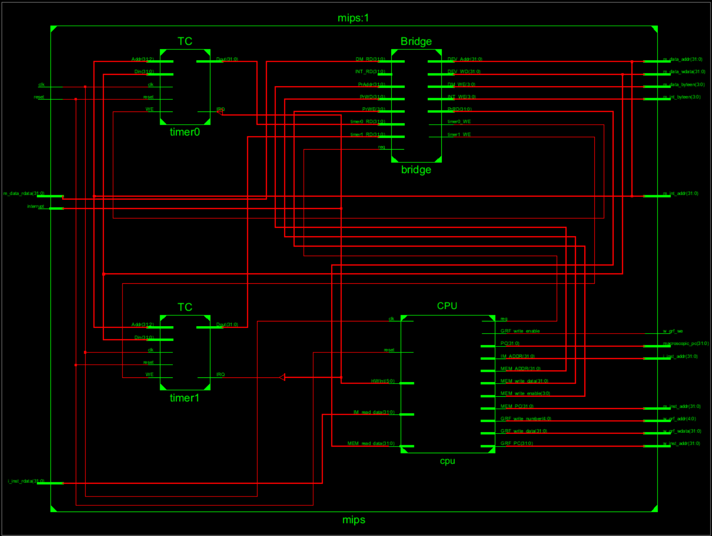
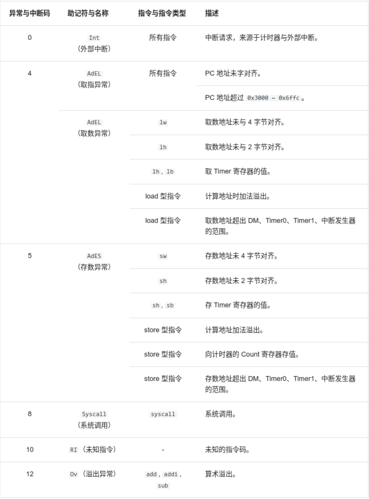
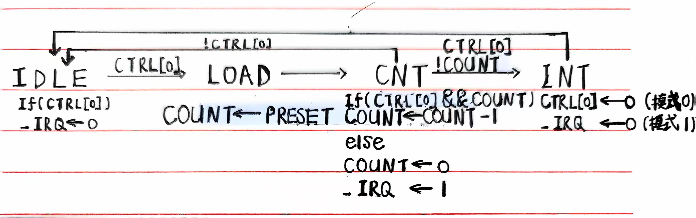

# Verilog MIPS 微系统

## 一、设计草稿

系统桥：Bridge
计时器：TC （例化两个，即 Timer0 和 Timer1）
CPU 功能模块： PC、GRF、EXT、CMP、NPC、ALU、MDU、BE、DE、Control 和 HazardControl
CPU 流水线寄存器：ID_REG、DE_REG、EM_REG、MW_REG
协处理器：CP0 （M 级）

流水 PC 而非 PC + 8，需转发时再做加法，以适应宏观 PC 输出需要。
译码信号时，区分可忽略的信号和无操作的信号，防止产生预料之外的异常。
MDU 分离乘除操作和写入操作，以使译码逻辑统一。禁止打断，以使异常 / 中断处理程序行为正确。
流水线寄存器 PC 复位值为 32‘h00003000，异常 / 中断请求的 PC 值为 32’h00004180，清空（插入空泡）时 PC 和 BD 正常流水。
新增 ERET 和 MTC0 冒险处理，包括 DE 阻塞和 CP0 内 EPC 的内部转发。
各类异常在 CPU 内置功能模块内产生，在 CPU 顶层模块内译码。取指异常时视为 NOP 进行流水。

各外设地址记录如下

|         条目         |                 地址或地址范围                 |          备注          |
| :------------------: | :--------------------------------------------: | :--------------------: |
|      数据存储器      | 0x0000_0000∼0x0000_2FFF0x0000_0000∼0x0000_2FFF |                        |
|      指令存储器      | 0x0000_3000∼0x0000_6FFF0x0000_3000∼0x0000_6FFF |                        |
|      PC 初始值       |             0x0000_30000x0000_3000             |                        |
| 异常处理程序入口地址 |             0x0000_41800x0000_4180             |                        |
| 计时器 0 寄存器地址  | 0x0000_7F00∼0x0000_7F0B0x0000_7F00∼0x0000_7F0B | 计时器 0 的 3 个寄存器 |
| 计时器 1 寄存器地址  | 0x0000_7F10∼0x0000_7F1B0x0000_7F10∼0x0000_7F1B | 计时器 1 的 3 个寄存器 |
|  中断发生器响应地址  | 0x0000_7F20∼0x0000_7F230x0000_7F20∼0x0000_7F23 |                        |

异常与中断码记录如下

### （一）F 级

#### （1）PC

| 信号名  | 方向 |    类型     |     描述     |
| :-----: | :--: | :---------: | :----------: |
|   clk   |  I   |    wire     |   时钟信号   |
|  reset  |  I   |    wire     | 同步复位信号 |
|  stall  |  I   |    wire     |   阻塞信号   |
| next_PC |  I   | wire [31:0] | 下一指令地址 |
|   PC    |  O   | wire [31:0] | 当前指令地址 |

起始地址：0x00003000

阻塞信号有效时，忽略输入，内部寄存器保持一个时钟周期。

### （二）D 级

FD 流水线寄存器

|  信号名   | 方向 |    类型     |        描述         |
| :-------: | :--: | :---------: | :-----------------: |
|    clk    |  I   |    wire     |      时钟信号       |
|   reset   |  I   |    wire     |    同步复位信号     |
|    req    |  I   |    wire     | 异常 / 中断请求信号 |
|   stall   |  I   |    wire     |      阻塞信号       |
|   flush   |  I   |    wire     |      清空信号       |
|   F_PC    |  I   | wire [31:0] |       F 级 PC       |
|  F_instr  |  I   | wire [31:0] |      F 级指令       |
| F_ExcCode |  I   | wire [4:0]  |     F 级异常码      |
|   F_BD    |  I   |    wire     |   F 级延迟槽标志    |
|   D_PC    |  O   | wire [31:0] |       D 级 PC       |
|  D_instr  |  O   | wire [31:0] |      D 级指令       |
| D_ExcCode |  O   | wire [4:0]  |     D 级异常码      |
|   D_BD    |  O   |    wire     |   D 级延迟槽标志    |

信号优先级：reset > req > stall > flush
保证复位优先，请求次之，且阻塞时不清空。

复位 PC 值为 32‘h00003000，请求 PC 值为 32’h00004180，清空（插入空泡）时 PC 和 BD 正常流水。

#### 1. GRF（同时是 D 级和 W 级组件）

|    信号名    | 方向 |    类型     |         描述          |
| :----------: | :--: | :---------: | :-------------------: |
|     clk      |  I   |    wire     |       时钟信号        |
|    reset     |  I   |    wire     |     同步复位信号      |
| read_number1 |  I   | wire [4:0]  |      读寄存器1号      |
| read_number2 |  I   | wire [4:0]  |      读寄存器2号      |
| write_enable |  I   |    wire     |     寄存器写使能      |
| write_number |  I   | wire [4:0]  |      写寄存器号       |
|  write_data  |  I   | wire [31:0] |     写寄存器数据      |
|      PC      |  I   | wire [31:0] |   指令地址（调试）    |
|  read_data1  |  O   | wire [31:0] | 读寄存器1数据（原始） |
|  read_data2  |  O   | wire [31:0] | 读寄存器2数据（原始） |

当写寄存器号为 0 时，替换写入数据为 0。

GRF 模块内实现 W 级向 W 级的内部转发。
当写使能为高电平、读写寄存器号相同且不为零时，用即将写入的数据替代实际读出的数据。

根据 FWD_to_D 信号，选择接受 E 级或 M 级的转发数据，透明代理 rs_data 和 rt_data。

因为宏观 PC是 M 级 PC，所以异常 / 中断请求有效时，GRF 应该正常写入。

#### 2. EXT

##### （1）模块结构

|  信号名   | 方向 |    类型     |   描述   |
| :-------: | :--: | :---------: | :------: |
|  operand  |  I   | wire [31:0] |  操作数  |
| operation |  I   | wire [1:0]  | 操作类型 |
|  result   |  O   | reg [31:0]  |   结果   |

##### （2）功能描述

| operation |           功能           |
| :-------: | :----------------------: |
|    00     |          零拓展          |
|    01     |         符号拓展         |
|    10     | 加载到高 16 位，低位补 0 |

#### 3. CMP

（1）模块结构

|  信号名   | 方向 |        类型        |   描述   |
| :-------: | :--: | :----------------: | :------: |
| operand1  |  I   | wire signed [31:0] | 操作数1  |
| operand2  |  I   | wire signed [31:0] | 操作数2  |
| operation |  I   |     wire [2:0]     | 操作类型 |
|  result   |  O   |        reg         |   结果   |

##### （2）功能描述

| operation |   功能   |
| :-------: | :------: |
|    000    |   等于   |
|    001    |  不等于  |
|    010    |   小于   |
|    011    | 大于等于 |
|    100    |   大于   |
|    101    | 小于等于 |

默认为有符号数比较。

#### 4. NPC（同时是 F 级和 D 级组件）

##### （1）模块结构

|       信号名       | 方向 |    类型     |        描述        |
| :----------------: | :--: | :---------: | :----------------: |
|        F_PC        |  I   | wire [31:0] |      F 级 PC       |
|        D_PC        |  I   | wire [31:0] |      D 级 PC       |
| instr_index_offset |  I   | wire [25:0] | 立即地址和偏移地址 |
|      regester      |  I   | wire [31:0] |      rs寄存器      |
|        EPC         |  I   | wire [31:0] |     异常返回PC     |
|       branch       |  I   | wire [1:0]  |      分支信号      |
|        jump        |  I   | wire [1:0]  |      跳转信号      |
|     condition      |  I   |    wire     |      分支条件      |
|      next_PC       |  O   | reg [31:0]  |      下一 PC       |

不分支 / 跳转时，next_PC = F_PC + 32'd4。
需分支时，CMP_result 表示分支条件，next_PC 用 D_PC 计算。
需跳转时，next_PC 用 D_PC 计算。

##### （2）功能描述

**Branch**

| Branch |          分支信号          |
| :----: | :------------------------: |
|   00   |           不分支           |
|   01   | 低可能性分支（保留延迟槽） |
|   10   | 高可能性分支（清空延迟槽） |

是否（条件）链接不由此信号控制，由相关寄存器写入信号控制。

**Jump**

| Jump |        跳转信号        |
| :--: | :--------------------: |
|  00  |         不跳转         |
|  01  |     跳转到立即地址     |
|  10  |    跳转到寄存器地址    |
|  11  | 异常返回（跳转到 EPC） |

是否（条件）链接不由此信号控制，由相关寄存器写入信号控制。

### （三）E 级

DE 流水线寄存器

|       信号名       | 方向 |    类型     |          描述          |
| :----------------: | :--: | :---------: | :--------------------: |
|        clk         |  I   |    wire     |        时钟信号        |
|       reset        |  I   |    wire     |      同步复位信号      |
|        req         |  I   |    wire     |  异常 / 中断请求信号   |
|       stall        |  I   |    wire     |        阻塞信号        |
|       flush        |  I   |    wire     |        清空信号        |
|      D_instr       |  I   | wire [31:0] |        D 级指令        |
|        D_PC        |  I   | wire [31:0] |        D 级 PC         |
|     D_rs_data      |  I   | wire [31:0] |     D 级 rs 寄存器     |
|     D_rt_data      |  I   | wire [31:0] |     D 级 rt 寄存器     |
|    D_EXT_result    |  I   | wire [31:0] |   D 级 EXT 拓展结果    |
| D_REG_write_number |  I   | wire [4:0]  |     D 级写寄存器号     |
| D_REG_write_enable |  I   |    wire     |    D 级寄存器写使能    |
|     D_ExcCode      |  I   | wire [4:0]  |       D 级异常码       |
|        D_BD        |  I   |    wire     |     D 级延迟槽标志     |
|      E_instr       |  O   | wire [31:0] |        E 级指令        |
|       E_PC8        |  O   | wire [31:0] |      E 级 PC + 8       |
|     E_rs_data      |  O   | wire [31:0] | E 级 rs 寄存器（原始） |
|     E_rt_data      |  O   | wire [31:0] | E 级 rt 寄存器（原始） |
|    E_EXT_result    |  O   | wire [31:0] |   E 级 EXT 拓展结果    |
| E_REG_write_number |  O   | wire [4:0]  |     E 级写寄存器号     |
| E_REG_write_enable |  O   |    wire     |    E 级寄存器写使能    |
|     E_ExcCode      |  O   | wire [4:0]  |       E 级异常码       |
|        E_BD        |  O   |    wire     |     E 级延迟槽标志     |

信号优先级：reset > req > stall > flush
保证复位优先，请求次之，且阻塞时不清空。

复位 PC 值为 32‘h00003000，请求 PC 值为 32’h00004180，清空（插入空泡）时 PC 和 BD 正常流水。

根据 FWD_to_E 信号，选择接受 M 级或 W 级的转发数据，透明代理 rs_data 和 rt_data。

根据 RegSrc 信号，选择转发 PC + 8 或 EXT_result。

#### 1. ALU

##### （1）模块结构

|  信号名   | 方向 |    类型     |   描述   |
| :-------: | :--: | :---------: | :------: |
| operand1  |  I   | wire [31:0] | 操作数1  |
| operand2  |  I   | wire [31:0] | 操作数2  |
| operation |  I   | wire [3:0]  | 操作类型 |
|  result   |  O   | reg [31:0]  | 运算结果 |
| overflow  |  O   |     reg     | 溢出标志 |

##### （2）功能描述

| operation |         功能         |
| :-------: | :------------------: |
|   0000    |          无          |
|   0001    | 有符号加（考虑溢出） |
|   0010    | 无符号加（忽略溢出） |
|   0011    | 有符号减（考虑溢出） |
|   0100    | 无符号减（忽略溢出） |
|   0101    |        按位与        |
|   0110    |        按位或        |
|   0111    |       按位异或       |
|   1000    |       按位或非       |
|   1001    |       逻辑左移       |
|   1010    |       逻辑右移       |
|   1011    |       算数右移       |
|   1100    |      有符号小于      |
|   1101    |      无符号小于      |

#### 2. MDU

##### （1）模块结构

|    信号名    | 方向 |    类型     |         描述         |
| :----------: | :--: | :---------: | :------------------: |
|     clk      |  I   |    wire     |       时钟信号       |
|    reset     |  I   |    wire     |     同步复位信号     |
|     req      |  I   |    wire     | 异常 / 中断请求信号  |
|   operand1   |  I   | wire [31:0] |       操作数1        |
|   operand2   |  I   | wire [31:0] |       操作数2        |
|  operation   |  I   | wire [2:0]  |       操作类型       |
| write_enable |  I   | wire [1:0]  | HI / LO 寄存器写使能 |
|      HI      |  O   | wire [31:0] |      HI 寄存器       |
|      LO      |  O   | wire [31:0] |      LO 寄存器       |
|    start     |  O   |    wire     |       开始信号       |
|     busy     |  O   |    wire     |       忙碌信号       |

##### （2）功能描述

| operation |   功能   |
| :-------: | :------: |
|    000    |  无操作  |
|    001    | 有符号乘 |
|    010    | 无符号乘 |
|    011    | 有符号除 |
|    100    | 无符号除 |

乘除一旦开始，无法打断。除零不变。
异常 / 中断请求有效时，禁止写入和开始乘除。

### （四）M 级

EM 流水线寄存器

|       信号名       | 方向 |    类型     |          描述          |
| :----------------: | :--: | :---------: | :--------------------: |
|        clk         |  I   |    wire     |        时钟信号        |
|       reset        |  I   |    wire     |      同步复位信号      |
|        req         |  I   |    wire     |  异常 / 中断请求信号   |
|       stall        |  I   |    wire     |        阻塞信号        |
|       flush        |  I   |    wire     |        清空信号        |
|      E_instr       |  I   | wire [31:0] |        E 级指令        |
|        E_PC        |  I   | wire [31:0] |        E 级 PC         |
|     E_rt_data      |  I   | wire [31:0] |     E 级 rt 寄存器     |
|    E_ALU_result    |  I   | wire [31:0] |   E 级 ALU 计算结果    |
|      E_HI_LO       |  I   | wire [31:0] |  E 级 HI / LO 寄存器   |
| E_REG_write_number |  I   | wire [4:0]  |     E 级写寄存器号     |
| E_REG_write_enable |  I   |    wire     |    E 级寄存器写使能    |
|     E_ExcCode      |  I   | wire [4:0]  |       E 级异常码       |
|        E_BD        |  I   |    wire     |     E 级延迟槽标志     |
|      M_instr       |  O   | wire [31:0] |        M 级指令        |
|       M_PC8        |  O   | wire [31:0] |      M 级 PC + 8       |
|     M_rt_data      |  O   | wire [31:0] | M 级 rt 寄存器（原始） |
|    M_ALU_result    |  O   | wire [31:0] |   M 级 ALU 计算结果    |
|      M_HI_LO       |  O   | wire [31:0] |  M 级 HI / LO 寄存器   |
| M_REG_write_number |  O   | wire [4:0]  |     M 级写寄存器号     |
| M_REG_write_enable |  O   |    wire     |    M 级寄存器写使能    |
|     M_ExcCode      |  O   | wire [4:0]  |       M 级异常码       |
|        M_BD        |  O   |    wire     |     M 级延迟槽标志     |

信号优先级：reset > req > stall > flush
保证复位优先，请求次之，且阻塞时不清空。

复位 PC 值为 32‘h00003000，请求 PC 值为 32’h00004180，清空（插入空泡）时 PC 和 BD 正常流水。

根据 FWD_to_M 信号，选择接受 W 级的转发数据，透明代理 rt_data。

根据 RegSrc 信号，选择转发 PC + 8、HI_LO 或 ALU_result。

#### 1. BE

##### （1）模块结构

|   信号名    | 方向 |    类型     |            描述             |
| :---------: | :--: | :---------: | :-------------------------: |
|    ADDR     |  I   | wire [31:0] |      低 2 位写内存地址      |
|   data_in   |  I   | wire [31:0] | 原始写内存数据（rt 寄存器） |
|  operation  |  I   | wire [1:0]  |         BE 操作类型         |
|  data_out   |  O   | wire [31:0] |     调制后的写内存数据      |
| data_enable |  O   | wire [3:0]  |         写字节使能          |
|  exception  |  O   |    wire     |        存数异常标志         |

##### （2）功能描述

| operation |   功能   |
| :-------: | :------: |
|    00     | 禁用写入 |
|    01     | 按字节写 |
|    10     | 按半字写 |
|    11     |  按字写  |

#### 2. DE

##### （1）模块结构

|  信号名   | 方向 |    类型     |        描述        |
| :-------: | :--: | :---------: | :----------------: |
|   ADDR    |  I   | wire [31:0] | 写内存低 2 位地址  |
|  data_in  |  I   | wire [31:0] |   实际读内存数据   |
| operation |  I   | wire [2:0]  |    DE 操作类型     |
| data_out  |  O   | wire [31:0] | 调制后的读内存数据 |
| exception |  O   |    wire     |    取数异常标志    |

##### （2）功能描述

| operation |      功能      |
| :-------: | :------------: |
|    000    |    禁用拓展    |
|    001    | 无拓展（直连） |
|    010    | 字节无符号拓展 |
|    011    | 字节有符号拓展 |
|    100    | 半字无符号拓展 |
|    101    | 半字有符号拓展 |

#### 3. CP0

##### （1）模块结构

|    信号名    | 方向 |    类型     |        描述         |
| :----------: | :--: | :---------: | :-----------------: |
|     clk      |  I   |    wire     |      时钟信号       |
|    reset     |  I   |    wire     |    同步复位信号     |
|     req      |  I   |    wire     | 异常 / 中断请求信号 |
|    number    |  I   | wire [4:0]  |    读写寄存器号     |
| write_enable |  I   |    wire     |    寄存器写使能     |
|  write_data  |  I   | wire [31:0] |    寄存器写数据     |
|     VPC      |  I   | wire [31:0] |       受害 PC       |
|     BDIn     |  I   |    wire     |     延迟槽标志      |
|  ExcCodeIn   |  i   | wire [4:0]  |       异常码        |
|    HWInt     |  I   | wire [5:0]  |    硬件中断信号     |
|    EXLClr    |  I   |    wire     |    异常返回信号     |
|  read_data   |  O   | wire [31:0] |    寄存器读数据     |
|    EPCOut    |  O   | wire [31:0] |     异常返回 PC     |
|   Request    |  O   |    wire     | 异常 / 中断请求信号 |

异常 / 中断请求有效时，禁止显式写入。

##### （2）内部说明

| 寄存器 | 编号 | 功能                              |
| :----- | :--- | :-------------------------------- |
| SR     | 12   | 配置异常的功能。                  |
| Cause  | 13   | 记录异常发生的原因和情况。        |
| EPC    | 14   | 记录异常处理结束后需要返回的 PC。 |

| 寄存器               | 功能域                  | 位域  | 解释                                                         |
| :------------------- | :---------------------- | :---- | :----------------------------------------------------------- |
| SR（State Register） | IM（Interrupt Mask）    | 15:10 | 分别对应六个外部中断，相应位置 1 表示允许中断，置 0 表示禁止中断。这是一个被动的功能，只能通过 `mtc0` 这个指令修改，通过修改这个功能域，我们可以屏蔽一些中断。 |
| SR（State Register） | EXL（Exception Level）  | 1     | 任何异常发生时置位，这会强制进入核心态（也就是进入异常处理程序）并禁止中断。 |
| SR（State Register） | IE（Interrupt Enable）  | 0     | 全局中断使能，该位置 1 表示允许中断，置 0 表示禁止中断。     |
| Cause                | BD（Branch Delay）      | 31    | 当该位置 1 的时候，EPC 指向当前指令的前一条指令（一定为跳转），否则指向当前指令。 |
| Cause                | IP（Interrupt Pending） | 15:10 | 为 6 位待决的中断位，分别对应 6 个外部中断，相应位置 1 表示有中断，置 0 表示无中断，将会每个周期被修改一次，修改的内容来自计时器和外部中断。 |
| Cause                | ExcCode                 | 6:2   | 异常编码，记录当前发生的是什么异常。                         |
| EPC                  | -                       | -     | 记录异常处理结束后需要返回的 PC。                            |

### （五）W 级

MW 流水线寄存器

|       信号名       | 方向 |    类型     |        描述        |
| :----------------: | :--: | :---------: | :----------------: |
|        clk         |  I   |    wire     |      时钟信号      |
|       reset        |  I   |    wire     |    同步复位信号    |
|       stall        |  I   |    wire     |      阻塞信号      |
|       flush        |  I   |    wire     |      清空信号      |
|      M_instr       |  I   | wire [31:0] |      M 级指令      |
|        M_PC        |  I   | wire [31:0] |      M 级 PC       |
|    M_ALU_result    |  I   | wire [31:0] | M 级 ALU 计算结果  |
|      M_HI_LO       |  I   | wire [31:0] | M 级 HI / LO寄存器 |
|  M_MEM_read_data   |  I   | wire [31:0] |   M 级读内存数据   |
| M_REG_write_number |  I   | wire [4:0]  |   M 级写寄存器号   |
| M_REG_write_enable |  I   |    wire     |  M 级寄存器写使能  |
|     M_ExcCode      |  I   | wire [4:0]  |     M 级异常码     |
|        M_BD        |  I   |    wire     |   M 级延迟槽标志   |
|      W_instr       |  O   | wire [31:0] |      W 级指令      |
|        W_PC        |  O   | wire [31:0] |      W 级 PC       |
|    W_ALU_result    |  O   | wire [31:0] | W 级 ALU 计算结果  |
|      W_HI_LO       |  O   | wire [31:0] | W 级 HI / LO寄存器 |
|  W_MEM_read_data   |  O   | wire [31:0] |   W 级读内存数据   |
| W_REG_write_number |  O   | wire [4:0]  |   W 级写寄存器号   |
| W_REG_write_enable |  O   |    wire     |  W 级寄存器写使能  |
|     W_ExcCode      |  O   | wire [4:0]  |     W 级异常码     |
|        W_BD        |  O   |    wire     |   W 级延迟槽标志   |

信号优先级：reset > req > stall > flush
保证复位优先，请求次之，且阻塞时不清空。

复位 PC 值为 32‘h00003000，请求 PC 值为 32’h00004180，清空（插入空泡）时 PC 和 BD 正常流水。

转发 REG_write_data，即根据 RegSrc 选择 PC + 8、ALU_result、HI_LO 、MEM_read_data 或 CP0_read_data。

### （六）Controller（控制器）

##### （1）整体结构

|    信号名    | 方向 |    类型    |                   描述                    |
| :----------: | :--: | :--------: | :---------------------------------------: |
| PIPELINE |  | parameter | 流水级 |
| instr  |  I   | wire [31:0] |                   指令                    |
|    Branch    |  O   |  reg [1:0]  |                 分支信号                  |
|     Jump     |  O   |  reg [1:0]  |                 跳转信号                  |
|    CMPSrc    |  O   |    reg     |          CMP 第二个操作数来源选择          |
|    CMPOp     |  O   |  reg [2:0]  |                CMP 操作类型                |
|    EXTOp     |  O   |  reg [1:0]  |                EXT 操作类型                |
|    ALUSrc    |  O   |  reg [3:0]  |             ALU 操作数来源选择             |
|    ALUOp     |  O   |  reg [3:0]  |                ALU 操作类型                |
| MDUop | O | reg [2:0] | MDU 操作类型 |
|     MemWrite     |  O   |  reg [1:0]  |                BE 操作类型                |
| DEop | O | reg [2:0] | DE 操作类型 |
|    RegSrc    |  O   |  reg [2:0]  |          寄存器写入数据来源选择           |
|    RegDst    |  O   |  reg [1:0]  |          寄存器写入数据位置选择           |
|   RegWrite   |  O   |  reg [2:0]  |       寄存器写使能            |
| Tuse_rs |  O   |  reg signed [2:0]  | 指令到达 D 级后，rs 寄存器距被使用的剩余周期 |
|   Tuse_rt    |  O   |  reg signed [2:0]  |   指令到达 D 级后，rt 寄存器距被使用的剩余周期   |
|     Tnew     |  O   |  reg signed [2:0]  |    指令到达 E 级后，距产生可写数据的剩余周期    |
| Excption | O | reg [1:0] | 异常指令类型 |

##### （2）信号说明

各种操作类型已在各自模块描述。
T 型信号见后 HazardControl 部分。

**CMPSrc**

| CMPSrc | CMP 第二个操作来源 |
| :----: | :----------------: |
|   0    |         rt         |
|   1    |       32‘d0        |

**ALUSrc**

| ALUSrc | ALU 第一个操作数来源 | ALU 第二个操作数来源 |
| :----: | :------------------: | :------------------: |
|  0000  |      rs 寄存器       |      rt 寄存器       |
|  0010  |      rs 寄存器       |        立即数        |
|  0100  |      rs 寄存器       |        32'd0         |
|  0111  |      rt 寄存器       |        shamt         |
|  1001  |      rt 寄存器       |      rs 寄存器       |

**RegSrc**

| RegSrc | 寄存器写入数据来源 |
| :----: | :----------------: |
|  000   |        ALU         |
|  001   |        MEM         |
|  010   |     PC + 32‘d8     |
|  011   |         HI         |
|  100   |         LO         |

**RegDst**

| RegDst | 寄存器写入数据位置 |
| :----: | :----------------: |
|   00   |         rt         |
|   01   |         rd         |
|   10   |     5'd31(ra)      |

**RegWrite**

| RegWrite | 寄存器写使能 |
| :------: | :----------: |
|   000    |   禁用写入   |
|   001    | 无条件写 GPR |
|   010    | 有条件写 GPR |
|   011    | 无条件写 HI  |
|   100    | 无条件写 LO  |
|   101    | 无条件写 CP0 |

**Excption**

| Excption | 异常指令类型 |
| :------: | :----------: |
|    00    |    无异常    |
|    01    |   未知指令   |
|    10    |   系统调用   |

### （七）HazardControl

|       信号名       | 方向 |       类型        |         描述         |
| :----------------: | :--: | :---------------: | :------------------: |
|        D_rs        |  I   |    wire [4:0]     |       D 级 rs        |
|        D_rt        |  I   |    wire [4:0]     |       D 级 rt        |
|     D_Tuse_rs      |  I   | wire signed [2:0] |     D 级 Tuse_rs     |
|     D_Tuse_rt      |  I   | wire signed [2:0] |     D 级 Tuse_rt     |
|   D_MDU_request    |  I   |       wire        |  D 级请求 MDU 信号   |
|   D_CP0_request    |  I   |       wire        |  D 级请求 CP0 信号   |
|        E_rs        |  I   |    wire [4:0]     |       E 级 rs        |
|        E_rt        |  I   |    wire [4:0]     |       E 级 rt        |
| E_REG_write_number |  I   |    wire [4:0]     |    E 级写寄存器号    |
| E_REG_write_enable |  I   |       wire        |   E 级寄存器写使能   |
|     E_Tuse_rs      |  I   | wire signed [2:0] |     E 级 Tuse_rs     |
|     E_Tuse_rt      |  I   | wire signed [2:0] |     E 级 Tuse_rt     |
|       E_Tnew       |  I   | wire signed [2:0] |      E 级 Tnew       |
|     E_MDU_busy     |  I   |       wire        |   E 级 MDU 忙信号    |
|     E_CP0_busy     |  I   |       wire        |   E 级 CP0 忙信号    |
|     M_Tuse_rs      |  I   | wire signed [2:0] |     M 级 Tuse_rs     |
|     M_Tuse_rt      |  I   | wire signed [2:0] |     M 级 Tuse_rt     |
|       M_Tnew       |  I   | wire signed [2:0] |      M 级 Tnew       |
|        M_rs        |  I   |    wire [4:0]     |       M 级 rs        |
|        M_rt        |  I   |    wire [4:0]     |       M 级 rt        |
| M_REG_write_number |  I   |    wire [4:0]     |    M 级写寄存器号    |
| M_REG_write_enable |  I   |       wire        |   M 级寄存器写使能   |
|     W_Tuse_rs      |  I   | wire signed [2:0] |     W 级 Tuse_rs     |
|     W_Tuse_rt      |  I   | wire signed [2:0] |     W 级 Tuse_rt     |
|       W_Tnew       |  I   | wire signed [2:0] |      W 级 Tnew       |
|        W_rs        |  I   |    wire [4:0]     |       W 级 rs        |
|        W_rt        |  I   |    wire [4:0]     |       W 级 rt        |
| W_REG_write_number |  I   |    wire [4:0]     |    W 级写寄存器号    |
| W_REG_write_enable |  I   |       wire        |   W 级寄存器写使能   |
|       stall        |  O   |       wire        |       阻塞信号       |
|    FWD_to_D_rs     |  O   |    wire [1:0]     | D 级 rs 接收转发信号 |
|    FWD_to_D_rt     |  O   |    wire [1:0]     | D 级 rt 接收转发信号 |
|    FWD_to_E_rs     |  O   |    wire [1:0]     | E 级 rs 接收转发信号 |
|    FWD_to_E_rt     |  O   |    wire [1:0]     | E 级 rt 接收转发信号 |
|    FWD_to_M_rt     |  O   |    wire [1:0]     | M 级 rt 接收转发信号 |

#### 1. 险情分析

按教程要求的 CPU 设计只可能发生数据冒险，即各级流水线读写同一寄存器。

解决数据冒险可使用 AT 法，在合适时机进行阻塞和（接受）转发。

阻塞只发生在 D 级，转发为暴力转发。

##### ① 阻塞

D 级后面的流水级判断是否阻塞 D 级。

当后执行（新）的指令需要读取先执行（旧）的指令未产生（写入流水线寄存器）的新数据（写入流水线寄存器）时发生阻塞。
当请求使用 MDU 而 MDU 正忙时，当 ERET 在 D 级且 MTC0 在 M 级写 EPC 寄存器时也发生阻塞。

##### ② 转发

W 级之前的流水级（不包括 F 级）判断如何接受转发。

先执行（旧）的指令无论新数据是否可用都一概发送转发数据。
当后执行（新）的指令一旦可以读取先执行（旧）的指令刚产生（写入流水线寄存器）的新数据，
就按优先级（DE > EM > MW）选择最新的数据接受转发数据

#### 2. HazardControl 功能

A 条件：寄存器写使能、写寄存器号不为零、读写寄存器冲突（且读寄存器不超时），或 MDU 请求时正忙

阻塞 T 条件：Tnew > Tuse

接受转发 T 条件：Tnew == 0

#### 3. T值说明

对于忽略 T 值的指令，设置为 0 其实可以发生正确的行为。
为了调试方便，逻辑清晰，使用如下设置方法。

Tuse忽略表示不读寄存器，可设置为 3，理解为读超时。
由于任何指令均有 rs 和 rt 域，CPU 会认为任何指令都在读寄存器，A 条件可能满足（可以给A条件与上此信号信息）。
但由于此时 Tnew > Tuse 不满足，故T条件不满足，不会触发阻塞。
对于 Tnew = 0 的指令，T条件满足，若A条件也满足则可能触发转发。
但由于此时不读寄存器，即使接受转发，也不会产生影响。
所以 Tuse 忽略的指令不会触发阻塞，且转发无效。

Tnew忽略表示不写寄存器，可设置为 -1，理解为已写入。
由于此时 write_enable 不满足，故A条件不满足。
由于此时 Tnew > Tuse 不满足，故T条件不满足。
所以 Tnew 忽略的指令不会触发阻塞和转发。

### （八）Bridge（[文档](./L15-支持IO.pdf)）

|  信号名   | 方向 |    类型     |         描述          |
| :-------: | :--: | :---------: | :-------------------: |
|  PrAddr   |  I   | wire [31:0] |       逻辑地址        |
|   PrWD    |  I   | wire [31:0] |       写入数据        |
|   PrWE    |  I   | wire [3:0]  |       字节使能        |
|   DM_RD   |  I   | wire [31:0] |      DM 读取数据      |
| timer0_RD |  I   | wire [31:0] |    timer0 读取数据    |
| timer1_RD |  I   | wire [31:0] |    timer1 读取数据    |
|  INT_RD   |  I   | wire [31:0] | INT 读取数据（32‘d0） |
|   PrRD    |  I   | wire [31:0] |       读取数据        |
| DEV_Addr  |  i   | wire [31:0] |       物理地址        |
|  DEV_WD   |  I   | wire [31:0] |       写入数据        |
|   DM_WE   |  O   | wire [3:0]  |      DM 字节使能      |
| timer0_WE |  O   |    wire     |     timer0 写使能     |
| timer1_WE |  O   |    wire     |     timer1 写使能     |
|  INT_WE   |  O   | wire [3:0]  |     INT 字节使能      |

### （九）TC

使用课程组官方 TC（[文档](./COCO定时器设计规范-1.0.0.4.pdf)），仅作命名和语法微调。

## 二、测试方案

### （一）课下测试

[Testbench](./mips_txt.v)

[Testbench(INT)](./mips_txt_int.v)

[算术溢出处理程序](./overflow.asm)

[输入文件](./code.txt)

[输出文件](./output.txt)

### （二）自动测试

编写 Shell 脚本进行批量自动评测 ，编写 Python 脚本[预处理](./code_filler.py)和后处理数据。

大体思路为：使用数据生成器生成测试代码，使用魔改版 Mars 编译并生成标准输出，预处理测试数据，使用 VCS 编译并仿真，后处理测试数据，使用 diff 工具获取差异。

## 三、思考题

### （一）请查阅相关资料，说明鼠标和键盘的输入信号是如何被 CPU 知晓的？

鼠标和键盘等低速设备通过中断请求的方式与CPU通讯。以键盘为例，键盘按下时发出一个中断请求，中断请求经过中断控制器（集成在南桥中）处理发送至 CPU，CPU 根据不同的中断号执行不同的中断响应程序，中断响应程序把按下按键的编码读到寄存器中，可能再写入内存中。

### （二）请思考为什么我们的 CPU 处理中断异常必须是已经指定好的地址？如果你的 CPU 支持用户自定义入口地址，即处理中断异常的程序由用户提供，其还能提供我们所希望的功能吗？如果可以，请说明这样可能会出现什么问题？否则举例说明。（假设用户提供的中断处理程序合法）

1. 降低 CPU 复杂度
2. 在用户提供的中断处理程序合法的前提下，可以提供我们希望的功能。但这会使 CPU 内部细节暴露在外，增大程序兼容难度。程序员必须关注中断异常的入口地址，否则可能因自定义的入口地址不合法，或者与正常指令地址的关系不当，影响程序逻辑正确性。

### （三）为何与外设通信需要 Bridge？

CPU 的端口数量有限，能够处理的外设类型也有限，只能直接与部分高速外设通信。但外设的数量和类型通常较多， 且低速外设占比较大，CPU 无法直接承担与所有外设的通信工作。
Bridge 对外设通信进行抽象，向 CPU 提供统一的通信端口，降低 CPU 复杂度，提高通信灵活性。

### （四）请阅读官方提供的定时器源代码，阐述两种中断模式的异同，并分别针对每一种模式绘制状态转移图。

1. 模式 0 

    通常用于产生定时中断。

    当计数器倒计数为 0 后，计数器停止计数，此时控制寄存器中的使能 Enable 自动变为 0，中断信号将持续有效。当使能 Enable 被设置为 1 后，初值寄存器值再次被加载至计数器，计数器重新启动倒计数，中断信号重置。当控制寄存器中的中断屏蔽位被设置为 0 时，中断信号也将不再有效。

2. 模式 1 

    通常用于产生周期性脉冲。

    当计数器倒计数为 0 后，初值寄存器值被自动加载至计数器，计数器继续倒计数，只产生一周期的中断信号。

### （五）倘若中断信号流入的时候，在检测宏观 PC 的一级如果是一条空泡（你的 CPU 该级所有信息均为空）指令，此时会发生什么问题？在此例基础上请思考：在 P7 中，清空流水线产生的空泡指令应该保留原指令的哪些信息？

此时 EPC 将被置 0，异常返回时将无法返回至正确地址。

空泡是指令的延迟执行产生的，空泡的最后连接着实际指令，清空流水线产生的空泡指令应该保留原指令的 PC 和 BD 信息。

### （六）为什么 `jalr` 指令为什么不能写成 `jalr $31, $31`？

如果 `jalr` 指令以 `jalr $31 $31 `的形式出现，倘若在其延迟槽内发生异常或中断，则此时`$31` 寄存器的值已经被 `jalr` 改变，异常返回后，该条`jalr` 指令再次被执行，将跳转不到期望的 `PC` 。
